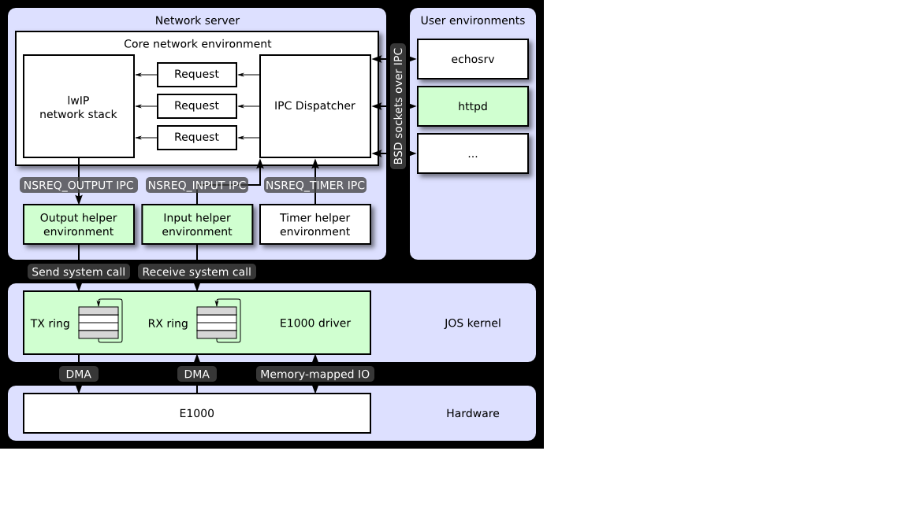
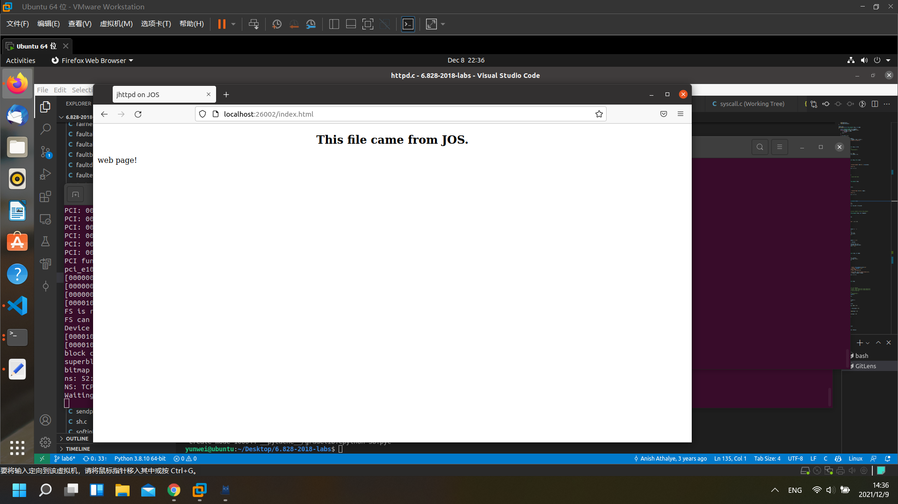

# MIT 6.828 操作系统工程 Lab6: 网络驱动程序

>这篇是我自己探索实现 MIT 6.828 lab6 的笔记记录，会包含一部分代码注释和要求的翻译记录，以及踩过的坑/个人的解决方案

这里是我实现的完整代码仓库，也包含其他笔记等等：[https://github.com/yunwei37/6.828-2018-labs](https://github.com/yunwei37/6.828-2018-labs)

目录：

<!-- TOC -->

- [MIT 6.828 操作系统工程 Lab6: 网络驱动程序](#mit-6828-操作系统工程-lab6-网络驱动程序)
  - [练习 1.time_tick](#练习-1time_tick)
  - [练习 2.浏览英特尔的E1000软件开发人员手册](#练习-2浏览英特尔的e1000软件开发人员手册)
  - [练习 3. 实现一个附加函数来初始化 E1000](#练习-3-实现一个附加函数来初始化-e1000)
  - [练习 4. mmio_map_regio](#练习-4-mmio_map_regio)
  - [练习 5.执行第 14.5 节（但不是其小节）中描述的初始化步骤。](#练习-5执行第-145-节但不是其小节中描述的初始化步骤)
  - [练习 6.](#练习-6)
  - [练习 7.](#练习-7)
  - [练习 8. 实现net/output.c](#练习-8-实现netoutputc)
  - [练习 10.按照 14.4 节的过程设置接收队列并配置 E1000](#练习-10按照-144-节的过程设置接收队列并配置-e1000)
  - [练习 11.](#练习-11)
  - [练习 12. 实现net/input.c。](#练习-12-实现netinputc)
  - [练习 13.send_data。](#练习-13send_data)
  - [e1000.h](#e1000h)

<!-- /TOC -->

lab6 实际上并没有想象中那么难，代码量很少，主要是需要理解网卡外设的运作方式。

根据网页上的提示，在需要的时候去查找手册就好。

理解这张图的结构：

## 练习 1.time_tick

一个简单的接口调用。

syscall.c
```c
static int
sys_time_msec(void)
{
	// LAB 6: Your code here.
	return time_msec();
}
```

## 练习 2.浏览英特尔的E1000软件开发人员手册

现在不要担心细节；只需感受一下文档的结构，您就可以稍后查找内容。

## 练习 3. 实现一个附加函数来初始化 E1000

pci:

```c
// pci_attach_vendor matches the vendor ID and device ID of a PCI device. key1
// and key2 should be the vendor ID and device ID respectively
struct pci_driver pci_attach_vendor[] = {
	{ 0x8086, 0x100e, pci_e1000_attach },
	{ 0, 0, 0 },
};
```

e1000
```c

volatile void *e1000_base = 0;

inline static void 
write_reg(int reg, uint32_t value) {
    assert(e1000_base);
    *(uint32_t*)(e1000_base + reg) = value;
}

inline static uint32_t 
read_reg(int reg) {
    assert(e1000_base);
    return *(uint32_t*)(e1000_base + reg);
}

int 
pci_e1000_attach(struct pci_func *pcif) 
{
    pci_func_enable(pcif);
    cprintf("pci_e1000_attach reg_base[0] %x reg_size[0] %x\n", pcif->reg_base[0], pcif->reg_size[0]);

    return 1;
}
```
## 练习 4. mmio_map_regio

在您的附加函数中，通过调用mmio_map_region（您在实验 4 中编写以支持内存映射 LAPIC）为 E1000 的 BAR 0 创建虚拟内存映射 。

```c
volatile void *e1000_base = 0;

inline static void 
write_reg(int reg, uint32_t value) {
    assert(e1000_base);
    *(uint32_t*)(e1000_base + reg) = value;
}

inline static uint32_t 
read_reg(int reg) {
    assert(e1000_base);
    return *(uint32_t*)(e1000_base + reg);
}

    ...
    e1000_base = mmio_map_region(pcif->reg_base[0], pcif->reg_size[0]);

    assert(read_reg(E1000_STATUS) == 0x80080783);
    ...

```


## 练习 5.执行第 14.5 节（但不是其小节）中描述的初始化步骤。

注意这里都需要使用物理地址。

```c
struct tx_desc TXDarray[TDARRAY_SIZE] = {0};
char tx_buffer[TDARRAY_SIZE * 1518] = {0};

    for (int i = 0;i < TDARRAY_SIZE; ++i) {
        TXDarray[i].addr = PADDR((tx_buffer + i * 1518));
        TXDarray[i].status |= 1;
        //TXDarray[i].length = 1518;
    }

    write_reg(E1000_TDBAH, 0);
    write_reg(E1000_TDBAL, PADDR(TXDarray));
    write_reg(E1000_TDLEN, sizeof(TXDarray));
    write_reg(E1000_TDH, 0);
    write_reg(E1000_TDT, 0);
    uint32_t tctl = read_reg(E1000_TCTL);
    tctl |= E1000_TCTL_EN;
    tctl |= E1000_TCTL_PSP;
    tctl |= 0x40000; // E1000_TCTL_COLD
    write_reg(E1000_TCTL, tctl);
    write_reg(E1000_TIPG, 0xa + (4 << 10) + (6 << 20));
```

## 练习 6.

编写一个函数，通过检查下一个描述符是否空闲，将数据包数据复制到下一个描述符，并更新 TDT 来传输数据包。确保您处理传输队列已满。

注意设置 E1000_TXD_CMD_EOP 位。

```c

int 
transmit_packet(void *src, size_t length) {
    int tail;
    
    assert(length < 1518);
    tail = read_reg(E1000_TDT);
    if (!(TXDarray[tail].status & 1)) {
        cprintf("TXDarray full tail %d\n", tail);
        return -E_NO_MEM;
    }
    memcpy(tx_buffer + 1518 * tail , src, length);
    TXDarray[tail].cmd |= 8; // E1000_TXD_CMD_RS
    TXDarray[tail].cmd |= 1; // E1000_TXD_CMD_EOP
    TXDarray[tail].status &= (~1);
    TXDarray[tail].length = length;
    //cprintf("send tail %d length %d %.*s\n", tail, TXDarray[tail].length, length, tx_buffer + 1518 * tail);
    write_reg(E1000_TDT, (tail + 1) % TDARRAY_SIZE);
    //assert(TXDarray[tail].status & 1);
    return 0;
}

```

## 练习 7.

添加一个系统调用，让您可以从用户空间传输数据包。确切的界面由您决定。不要忘记检查从用户空间传递给内核的任何指针。

```c
// Return the current time.
static int
sys_net_transmit(void *src, size_t length)
{
	// LAB 6: Your code here.
	user_mem_assert(curenv, src, length, 0);
	return transmit_packet(src, length);
}
```

## 练习 8. 实现net/output.c

```c
#define debug 0

void
output(envid_t ns_envid)
{
	binaryname = "ns_output";
	struct jif_pkt* nsipcreq = (struct jif_pkt *)REQVA;

	// LAB 6: Your code here:
	// 	- read a packet from the network server
	//	- send the packet to the device driver
	uint32_t req, whom;
	int perm, r;

	while (1) {
		perm = 0;
		req = ipc_recv((int32_t *) &whom, nsipcreq, &perm);
		if (debug)
			cprintf("output req %d from %08x [page %08x: %s]\n",
				req, whom, uvpt[PGNUM(nsipcreq)], nsipcreq);
		
		// All requests must contain an argument page
		if (!(perm & PTE_P)) {
			cprintf("Invalid request from %08x: no argument page\n",
				whom);
			continue; // just leave it hanging...
		}

		if (req == NSREQ_OUTPUT) {
			do {
				r = sys_net_transmit(nsipcreq->jp_data, nsipcreq->jp_len);
				if (r != 0) {
					sys_yield();
				}
			} while(r == -E_NO_MEM);
		} else {
			cprintf("Invalid request code %d from %08x\n", req, whom);
			r = -E_INVAL;
		}
		sys_page_unmap(0, nsipcreq);
	}
}

```

这里我们发送环满了之后选择进行轮询，直到有空的发送位置。

## 练习 10.按照 14.4 节的过程设置接收队列并配置 E1000

```c
struct rx_desc RXDarray[RDARRAY_SIZE] = {0};
char rx_buffer[RDARRAY_SIZE * 2048] = {0};

   write_reg(E1000_RA, 0x12005452);
    write_reg(E1000_RA + 4, 0x5634 | E1000_RAH_AV);
    for (size_t i = E1000_MTA; i< E1000_RA; i += 4) {
        write_reg(i, 0);
    }
    for (int i = 0;i < RDARRAY_SIZE; ++i) {
        RXDarray[i].addr = PADDR((rx_buffer + i * 2048));
        RXDarray[i].status = 0;
    }
    write_reg(E1000_RDBAH, 0);
    write_reg(E1000_RDBAL, PADDR(RXDarray));
    write_reg(E1000_RDLEN, sizeof(RXDarray));
    write_reg(E1000_RDH, 0);
    write_reg(E1000_RDT, RDARRAY_SIZE - 1);
    size_t rtcl = E1000_RCTL_EN;
    rtcl |= E1000_RCTL_SECRC;
    rtcl |= E1000_RCTL_BAM;
    write_reg(E1000_RCTL, rtcl);
```

## 练习 11.

编写一个函数来接收来自 E1000 的数据包，并通过添加系统调用将其暴露给用户空间。确保您处理接收队列为空。

```c

int 
receive_packet(void *dst) {
    int tail;

    tail = (read_reg(E1000_RDT) + 1) % RDARRAY_SIZE;
    if (!(RXDarray[tail].status & 1)) {
        //cprintf("RXDarray empty tail %d\n", tail);
        return -E_NO_MEM;
    }
    //cprintf("receive tail %d length %d\n", tail, RXDarray[tail].length);
    RXDarray[tail].status &= (~1);
    memcpy(dst, rx_buffer + 2048 * tail, RXDarray[tail].length);
    write_reg(E1000_RDT, tail);
    return RXDarray[tail].length;
}
```

## 练习 12. 实现net/input.c。

```c

static struct jif_pkt *pkt = (struct jif_pkt*)REQVA;

void
input(envid_t ns_envid)
{
	binaryname = "ns_input";
	int r;

	// LAB 6: Your code here:
	// 	- read a packet from the device driver
	//	- send it to the network server
	// Hint: When you IPC a page to the network server, it will be
	// reading from it for a while, so don't immediately receive
	// another packet in to the same physical page.
	if ((r = sys_page_alloc(0, pkt, PTE_P|PTE_U|PTE_W)) < 0)
			panic("sys_page_alloc: %e", r);
	while (1) {
		int length;
		do {
			length = sys_net_receive(pkt->jp_data);
			if (length == -E_NO_MEM) {
				sys_yield();
			}
		} while(length == -E_NO_MEM);
		if (length < 0) {
			cprintf("receive fail code %d from %08x\n", length);
		}
		pkt->jp_len = length;
		ipc_send(ns_envid, NSREQ_INPUT, pkt, PTE_P|PTE_U);
		sys_yield();
		sys_yield();
	}
}
```

同样，这里轮询等待。

## 练习 13.send_data。

```c
static int
send_data(struct http_request *req, int fd)
{
	// LAB 6: Your code here.
	//panic("send_data not implemented");
	int wl = 0, rl = 0;
	char buffer[256];
	do {
		rl = read(fd, buffer, 256);
		wl = write(req->sock, buffer, rl);
	} while (wl);
	return 0;
}


static int
send_file(struct http_request *req)
{
	int r;
	off_t file_size = -1;
	int fd;
	struct Stat fstate;

	// open the requested url for reading
	// if the file does not exist, send a 404 error using send_error
	// if the file is a directory, send a 404 error using send_error
	// set file_size to the size of the file

	// LAB 6: Your code here.
	// panic("send_file not implemented");
	fd = open(req->url, O_RDONLY);
	if (fd < 0) {
		send_error(req, 404);
		return fd;
	}
	r = fstat(fd, &fstate);
	if (r < 0 || fstate.st_isdir) {
		send_error(req, 404);
		return fd;
	}
	file_size = fstate.st_size;
    
```

效果：



## e1000.h

```c
#ifndef JOS_KERN_E1000_H
#define JOS_KERN_E1000_H

#include <kern/pci.h>

/* Register Set. (82543, 82544)
 *
 * Registers are defined to be 32 bits and  should be accessed as 32 bit values.
 * These registers are physically located on the NIC, but are mapped into the
 * host memory address space.
 *
 * RW - register is both readable and writable
 * RO - register is read only
 * WO - register is write only
 * R/clr - register is read only and is cleared when read
 * A - register array
 */
#define E1000_STATUS   0x00008  /* Device Status - RO */
#define E1000_TDBAL    0x03800  /* TX Descriptor Base Address Low - RW */
#define E1000_TDBAH    0x03804  /* TX Descriptor Base Address High - RW */
#define E1000_TDLEN    0x03808  /* TX Descriptor Length - RW */
#define E1000_TDH      0x03810  /* TX Descriptor Head - RW */
#define E1000_TDT      0x03818  /* TX Descripotr Tail - RW */
#define E1000_TCTL     0x00400  /* TX Control - RW */
#define E1000_TIPG     0x00410  /* TX Inter-packet gap -RW */
#define E1000_TXDCTL   0x03828  /* TX Descriptor Control - RW */
#define E1000_RA       0x05400  /* Receive Address - RW Array */
#define E1000_MTA      0x05200  /* Multicast Table Array - RW Array */
#define E1000_IMS      0x000D0  /* Interrupt Mask Set - RW */
#define E1000_RCTL     0x00100  /* RX Control - RW */
#define E1000_RDBAL    0x02800  /* RX Descriptor Base Address Low - RW */
#define E1000_RDBAH    0x02804  /* RX Descriptor Base Address High - RW */
#define E1000_RDLEN    0x02808  /* RX Descriptor Length - RW */
#define E1000_RDH      0x02810  /* RX Descriptor Head - RW */
#define E1000_RDT      0x02818  /* RX Descriptor Tail - RW */

/* Transmit Control */
#define E1000_TCTL_RST    0x00000001    /* software reset */
#define E1000_TCTL_EN     0x00000002    /* enable tx */
#define E1000_TCTL_BCE    0x00000004    /* busy check enable */
#define E1000_TCTL_PSP    0x00000008    /* pad short packets */
#define E1000_TCTL_CT     0x00000ff0    /* collision threshold */
#define E1000_TCTL_COLD   0x003ff000    /* collision distance */
#define E1000_TCTL_SWXOFF 0x00400000    /* SW Xoff transmission */
#define E1000_TCTL_PBE    0x00800000    /* Packet Burst Enable */
#define E1000_TCTL_RTLC   0x01000000    /* Re-transmit on late collision */
#define E1000_TCTL_NRTU   0x02000000    /* No Re-transmit on underrun */
#define E1000_TCTL_MULR   0x10000000    /* Multiple request support */

/* Transmit Descriptor bit definitions */
#define E1000_TXD_CMD_EOP    0x01000000 /* End of Packet */
#define E1000_TXD_CMD_RS     0x08000000 /* Report Status */
#define E1000_TXD_STAT_DD    0x00000001 /* Descriptor Done */

struct tx_desc
{
	uint64_t addr;
	uint16_t length;
	uint8_t cso;
	uint8_t cmd;
	uint8_t status;
	uint8_t css;
	uint16_t special;
};

/* Receive Descriptor */
struct rx_desc {
    uint64_t addr; /* Address of the descriptor's data buffer */
    uint16_t length;     /* Length of data DMAed into data buffer */
    uint16_t csum;       /* Packet checksum */
    uint8_t status;      /* Descriptor status */
    uint8_t errors;      /* Descriptor Errors */
    uint16_t special;
};

/* Receive Descriptor bit definitions */
#define E1000_RXD_STAT_DD       0x01    /* Descriptor Done */
#define E1000_RXD_STAT_EOP      0x02    /* End of Packet */

/* Receive Control */
#define E1000_RCTL_RST            0x00000001    /* Software reset */
#define E1000_RCTL_EN             0x00000002    /* enable */
#define E1000_RCTL_SBP            0x00000004    /* store bad packet */
#define E1000_RCTL_UPE            0x00000008    /* unicast promiscuous enable */
#define E1000_RCTL_DTYP_MASK      0x00000C00    /* Descriptor type mask */
#define E1000_RCTL_DTYP_PS        0x00000400    /* Packet Split descriptor */
#define E1000_RCTL_RDMTS_HALF     0x00000000    /* rx desc min threshold size */
#define E1000_RCTL_RDMTS_QUAT     0x00000100    /* rx desc min threshold size */
#define E1000_RCTL_RDMTS_EIGTH    0x00000200    /* rx desc min threshold size */
#define E1000_RCTL_BAM            0x00008000    /* broadcast enable */
/* these buffer sizes are valid if E1000_RCTL_BSEX is 0 */
#define E1000_RCTL_SZ_2048        0x00000000    /* rx buffer size 2048 */
#define E1000_RCTL_VFE            0x00040000    /* vlan filter enable */
#define E1000_RCTL_CFIEN          0x00080000    /* canonical form enable */
#define E1000_RCTL_CFI            0x00100000    /* canonical form indicator */
#define E1000_RCTL_DPF            0x00400000    /* discard pause frames */
#define E1000_RCTL_PMCF           0x00800000    /* pass MAC control frames */
#define E1000_RCTL_BSEX           0x02000000    /* Buffer size extension */
#define E1000_RCTL_SECRC          0x04000000    /* Strip Ethernet CRC */
#define E1000_RCTL_FLXBUF_MASK    0x78000000    /* Flexible buffer size */
#define E1000_RCTL_FLXBUF_SHIFT   27            /* Flexible buffer shift */

#define E1000_RAH_AV  0x80000000        /* Receive descriptor valid */

struct jif_pkt {
    int jp_len;
    char jp_data[0];
};

// Forward declarations
int pci_e1000_attach(struct pci_func *pcif);

int transmit_packet(void *src, size_t length);
int receive_packet(void *dst);

#endif  // SOL >= 6
```

完结撒花x